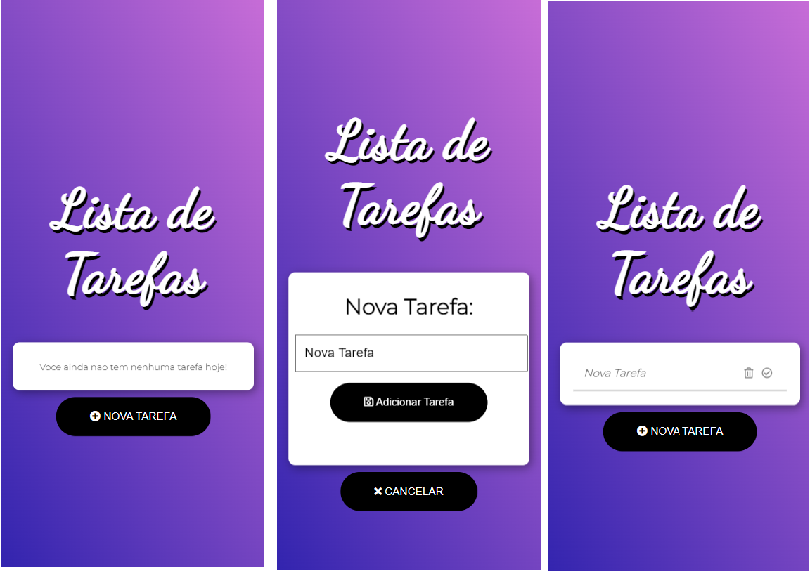

<p align="center">
  
</p>

<br>

## Inicializar Projeto Através do NPM


Nosso primeiro passo é clonar o projeto e entrar na pasta do projeto;

```bash
$ git clone https://github.com/Matheuscara/Angular_ToDo-List
```

O proximo passo é baixar as bibliotecas e iniciar o projeto;

```bash
npm install
npm run start
```

## Tecnologias:

O desenvolvimento se consiste em tais bibliotecas:

- [Angular](https://angular.io/guide/what-is-angular)
- [TypeScript](https://www.typescriptlang.org/)

## Justificativa de Arquitetura e Bibliotecas:

A minha intenção foi desenvolver uma solução que pudesse ser simples para uma primeira aplicacao, envolvendo todos os conceitos basicos do Angular

---
- typescript:
  - Tipagem de contextos, gerando menos problemas para o futuro.
---
